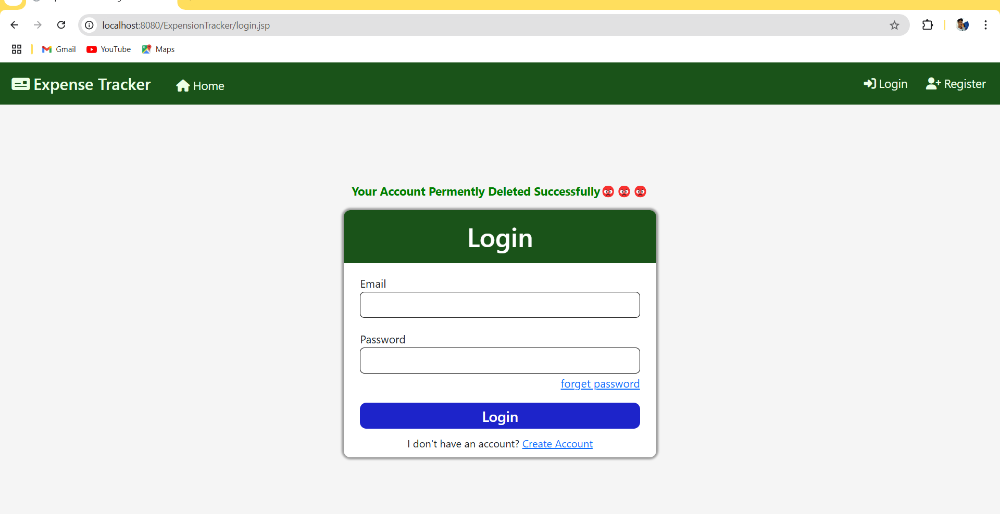

<h2 align="center">🌟 Expense Tracking System 🌟</h2>

This Expense Tracking System is a web application developed using <strong>Servlets</strong>, <strong>JSP</strong>, <strong>Hibernate</strong>, <strong>CSS</strong>, and <strong>MySQL</strong>. The application provides users with a seamless way to manage and track their expenses while incorporating robust features like user authentication, expense management, profile updating, and password recovery.

---

<h3 align="center">📂 Project Structure</h3>

The project is structured into three main layers:

<ol>
    <li><b>DAO Layer:</b> Responsible for the database logic and manages all CRUD (Create, Read, Update, Delete) operations. It facilitates interaction with the MySQL database, ensuring all user and expense data is stored and managed effectively.</li>
    <li><b>Controller Layer:</b> Includes Servlet classes that handle HTTP requests and responses, managing forms submitted by users and directing them to appropriate service methods.</li>
    <li><b>Model Layer:</b> Contains entity classes representing database tables. These classes allow Hibernate to map Java objects to database tables, facilitating efficient database operations.</li>
</ol>

---

<h3 align="center">🌟 Features</h3>

<h4>1. User Account Management</h4>
<ul>
    <li><b>User Registration:</b> New users can register by providing their details, which are securely stored in the database.</li>
    <li><b>Edit User Details:</b> Update personal information such as name, email, contact details, and password.</li>
    <li><b>Remove Account Permanently:</b> Delete accounts and all related data from the database for privacy.</li>
    <li><b>View User Details:</b> Users can verify and manage their account information.</li>
    <li><b>Login and Authentication:</b> Validates user credentials for secure login.</li>
    <li><b>Forgot Password:</b> Helps users reset their password via a secure process.</li>
</ul>

<h4>2. Expense Management</h4>
<ul>
    <li><b>Add Expenses:</b> Record new expenses with details like amount, category, date, and description.</li>
    <li><b>Edit Expenses:</b> Update existing records for accurate tracking.</li>
    <li><b>Delete Expenses:</b> Remove unnecessary or outdated records.</li>
    <li><b>View Expenses:</b> Display a list of recorded expenses with sorting and filtering options.</li>
</ul>

<h4>3. Session-based Messaging</h4>

Key actions within the application (login, expense management, etc.) display success or failure messages to users for feedback.

---

<h3 align="center">📸 Screenshots</h3>

Below are some screenshots showcasing the key features of the application:

    
    
<b>Figure 1:</b> Index Page

    
    
<b>Figure 2:</b> User Registration Page

    
    
<b>Figure 3:</b> User Login Page

    
    
<b>Figure 4:</b> Forgot Password Page

    
    
<b>Figure 5:</b> Change Password Page

    
    
<b>Figure 6:</b> Home Page

    
    
<b>Figure 7:</b> View Expenses Page

    
    
<b>Figure 8:</b> Add Expense Page

    
    
<b>Figure 9:</b> Edit Expense Page

    
    
<b>Figure 10:</b> Remove Expense Page

    
    
<b>Figure 11:</b> View Profile Page

    
    
<b>Figure 12:</b> Update Profile Page

    
    
<b>Figure 13:</b> Delete Account Page

---

<h3 align="center">🛠 Technologies Used</h3>
<ul>
    <li><b>Backend:</b> Java Servlets, Hibernate</li>
    <li><b>Frontend:</b> JSP, CSS</li>
    <li><b>Database:</b> MySQL</li>
</ul>

---

<h3 align="center">🔧 How It Works</h3>

JSP is used to create the user interfaces, allowing a combination of HTML and Java code for dynamic page rendering. The Hibernate framework manages the interactions between the Java application and the MySQL database to handle data operations.

---

<h3 align="center">📋 Prerequisites</h3>
<ul>
    <li>Java Development Kit (JDK) 8+</li>
    <li>Apache Tomcat (or any compatible Java Servlet container)</li>
    <li>MySQL Server</li>
    <li>Hibernate</li>
</ul>

---

<h3 align="center">💡 Getting Started</h3>

Follow the instructions below to set up and run the application on your local machine:

<ol>
    <li>Clone the repository: <code>git clone <repository-url></code></li>
    <li>Navigate to the project directory.</li>
    <li>Set up the database in MySQL and import the SQL scripts provided.</li>
    <li>Configure the application properties (e.g., database connection settings).</li>
    <li>Deploy the application on Apache Tomcat.</li>
    <li>Open your browser and navigate to <code>http://localhost:8080/yourapp</code>.</li>
</ol>

---

<h3 align="center">🎉 Enjoy tracking your expenses!</h3>
